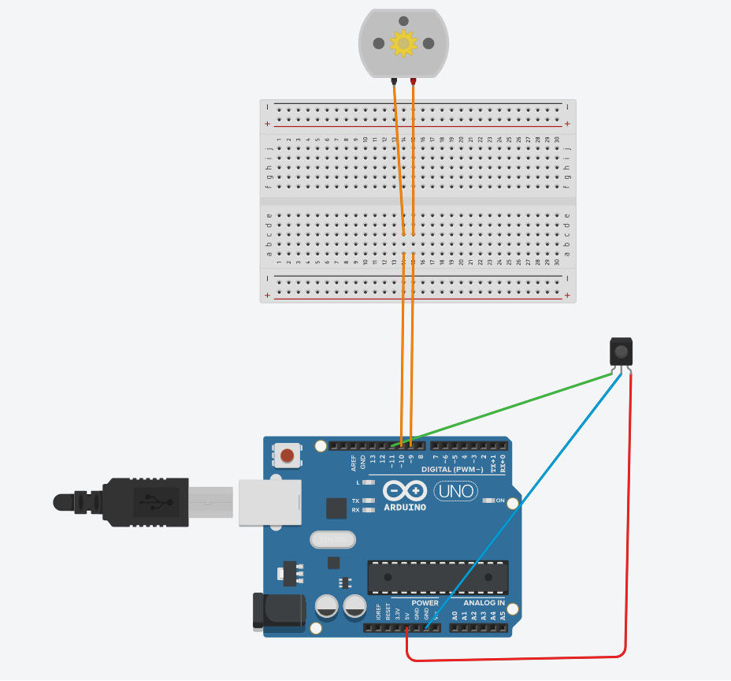

<h1>irOneMotorControl</h1>
<h2>Control one DC motor speed and direction with IR receiver with Arduino.</h2>

<p1>The code IRDecode signal.ino detect the buttons of your remote control</p1>

<p2>The code motorControl.ino is to control the speed and direction of your DC motor with IR receiver. </p2>
  

  

